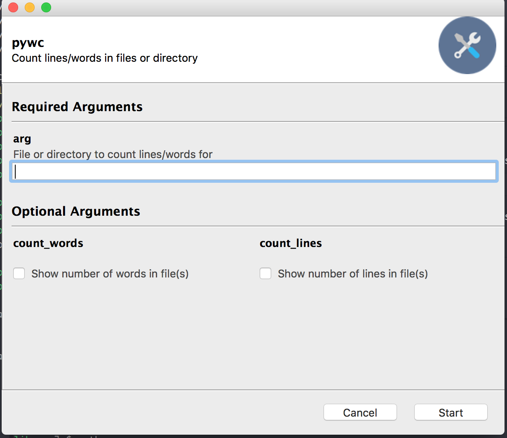

footer: [`http://bit.ly/pyconde_pywc_refs`](http://bit.ly/pyconde_pywc_refs)
slidenumbers: true

# [fit] Script, Library, or Executable?
# [fit] You can have it
# [fit] ALL!

---

# [fit] Luke Lee
## [fit] @durden20
Python GUI and CLI applications for Oil and Gas

---

# [fit] CLI
# [fit] Library
# [fit] GUI
# [fit] Executable

^ Show **one** way to expand CLI script to support CLI, lib, GUI, exe
- Walk-through this process showing the key changes at each step

---

# 1. CLI

```python
import sys

lines = 0
words = 0

with open(sys.argv[1], 'rb') as file_obj:
    for line in file_obj:
        lines += 1
        words += len(line.split())

print(f'{lines} {words}')
```

^ Clone of Unix wc to count words/lines in file
^ Limitations:
^   - No help
^   - Not extensible
^   - args vs. real work
^   - Reuse by other devs
^   - Requires Python
^   - Python 2/3 discussion

---

# [fit] Separation of concerns

^ - Parsing args vs. reading file
- Preached alot with GUIs
- sys.argv is user interface and counting lines/words is action

---

# Separation of concerns

```python
def cli():
    """
    Parse sys.argv and return dictionary of arguments/configuration
    """
    pass


def get_file_info(file_):
    """
    Return lines/words in file
    """
    pass


if __name__ == '__main__':
    file_ = cli()
    print(get_file_info(file_))
```

^ - Code reuse
- Only CLI interface knows of sys.argv
- Only prints when run as script

---

```python
file_info = collections.namedtuple('file_info', 'lines words')

def get_file_info(file_):
    lines = 0
    words = 0

    with open(file_, 'rb') as file_obj:
        for line in file_obj:
            lines += 1
            words += len(line.split())

    return file_info(lines, words)
```

---

```python
def cli():
    parser = argparse.ArgumentParser(prog='pywc')

    parser.add_argument('arg', action='store',
                        help='File or directory to count lines/words for')

    parser.add_argument('-w', dest='count_words', action='store_true',
                        default=False, help='Show number of words in file(s)')

    parser.add_argument('-l', dest='count_lines', action='store_true',
                        default=False, help='Show number of lines in file(s)')

    # Using vars() to turn namespace object returned by parse_args() into a
    # dict.
    args = vars(parser.parse_args())

    # Mimic wc command by printing both of these if there are no other
    # arguments
    if not args['count_words'] and not args['count_lines']:
        args['count_words'] = True
        args['count_lines'] = True

    return args
```

^ - Built-into stdlib
- Multiple arguments
- Automatic help
- vars() hides CLI detail from other code

---

# 2. Library

```
- setup.py
- pywc/
    - api.py
    - __init__.py
    - __main__.py
```

^ - setup.py -> pip install
- api.py = workhorse
- `__init__.py` = python package
- `__main__`.py` strange name, see why later

---

# setup.py

```python
from setuptools import setup, find_packages

setup(
    name='pywc',
    version='1.0.0',
    packages=find_packages(),
)

```

^ - pip install like pypi

---

# [fit] `__main__.py`

---

```python
from .api import get_file_info

def cli():
    """
    Parse sys.argv and return dictionary of arguments
    """
    pass

def main():
    args = cli()
    file_info = get_file_info(args['file'])

    if args['count_lines']:
        print(f'    {file_info.lines}', end='')

    if args['count_words']:
        print(f'    {file_info.words}', end='')

    print(f'    {args['file']}')

if __name__ == '__main__':
    main()
```

^ - Same as original script w/o 'real' code
- Separation of concerns: launch vs. library
- `main` keeps var/name pollution if we import

---

# [fit] CLI ?

^ - Locked away in pkg
- No outside interface
- Support using from Python, but no CLI

---

# [fit] entry_points

---

```python
from setuptools import setup

setup(
    name='pywc',
    version='1.0.0',
    packages=find_packages(),
    entry_points={
        'console_scripts': [
            'pywc = pywc.__main__:cli'
        ]
    },
)
```

^ - Looks and acts like prev single-file script
- Only when installed
- Requires users know about pip

---

# [fit] python -m

^ - Closer interface to orig script
- Supports `__main__` and `__main__.py`
- No need to install
- Package equivalent of `__init__ == __main__`

---

# `python -m`

` ` |  ` `  | ` `
---|---|---
http.server | json.tool | pdb
timeit | cProfile | unittest
doctests | tarfile | zipapp
zipfile | webbrowser | base64
calendar | sysconfig ||

^ Not all use __main__, but work with -m
- zipapp: zip directory and run `__main__.py` wo install
- sysconfig: how python binary was compiled

---

# `python -m pywc -h`
# `pywc -h`

---

# [fit] Gooey

---

# 3. GUI

```python
from gooey import Gooey

@Gooey
def cli():
    parser = argparse.ArgumentParser(
        prog='pywc',
        description='Count lines/words in files or directory')

    parser.add_argument(
        'arg', action='store',
        help='File or directory to count lines/words for')
    ...
```

^ - Works magic on argparse
- Uses wx
- Introspect and maps argparse actions/types to GUI elements
- Downside: Forces GUI unless `--ignore-gooey`

---



[.hide-footer]

---

# GUI as option (--gui)

```python
def cli(allow_gui_option=True):
    """
    Add --gui option to call gui()
    """
    pass

def gui():
    # Gooey doesn't like functools.partial
    def cli_only():
        return cli(allow_gui_option=False)

    return Gooey(cli_only, program_name='pywc',
                 show_success_modal=False)
```

---

```python
from setuptools import setup

setup(
    entry_points={
        'console_scripts': [
            'pywc = pywc.__main__:cli'
        ]
        'gui_scripts': [
            'pywcg = pywc.__main__:gui'
        ]
    },
)
```

---

# `python -m pywc --gui`
# `pywcg`

---

# [fit] PyInstaller

^ Pure magic
^ Supports PyQt, numpy, wx, ...
^ Windows, Linux, OSX

---

# [fit] ?


^ - Don't need anything installed, including Python!

---

# 4. Executable

```
- setup.py
- cli.py
- gui.py
- pywc/
    - api.py
    - __init__.py
    - __main__.py
```

^ - Pyinstaller :thumbsdown: relative imports
- 2 exes = 2 entry points
- Shared via `__main__.py`

---

# cli.py

```python
from pywc.__main__ import cli

if __name__ == '__main__':
    cli()
```

---

# gui.py

```python
from pywc.__main__ import gui

if __name__ == '__main__':
    gui()
```

---

# [fit] `pip install pyinstaller`

---

# [fit] `pyinstaller cli.py --name pywc`

---

# [fit] `pyinstaller gui.py --name pywcg -w`

^ - `--onefile`
- `--additional-hooks-dir`

---

# [fit] :heavy_exclamation_mark: Takeaways :heavy_exclamation_mark:
---

# [fit] Separation of concerns
---

# [fit] entry_points

^ - `console_scripts`
- `gui_scripts`

---

# [fit] `__main__.py`

^ - Benefits
- `-m` support
- Single-file entry point
- Commonly used pattern

---

# [fit] Gooey

---

# [fit] PyInstaller

---

# [fit] Ready. Set. Launch. :beers: :doughnut:

---

 `pywc`
 `pywc --gui`
 `pywcg`
 `python -m pywc`
 `python -m pywc --gui`
 `pywc.exe`
 `pywcg.exe`
 `python cli.py`
 `python cli.py --gui`
 `python gui.py`

---

# and these ... :smirk:

 `pywcg --gui`
 `python gui.py --gui`
 `pywcg.exe --gui`

^ - Quirk of Gooey introspection

---

# [fit] Luke Lee
## [fit] @durden20
### [fit] [`http://bit.ly/pyconde_pywc_refs`](http://bit.ly/pyconde_pywc_refs)
[.hide-footer]
